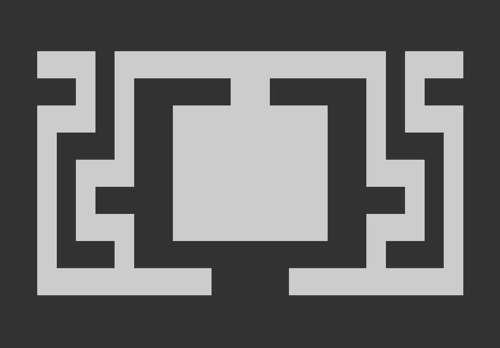
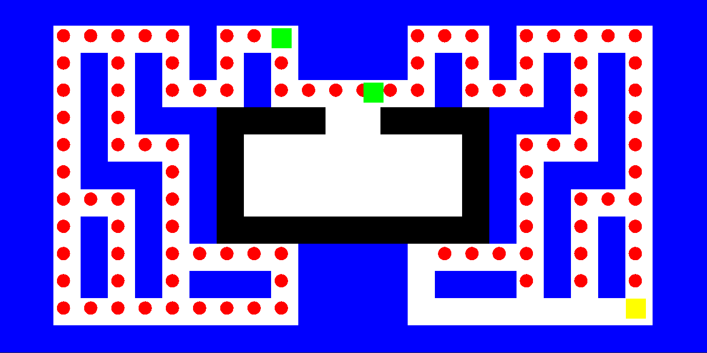
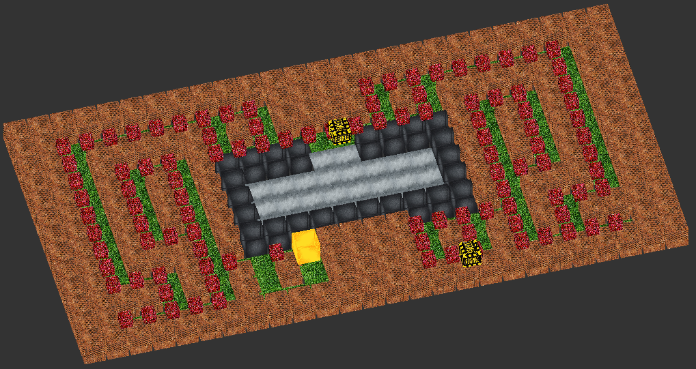
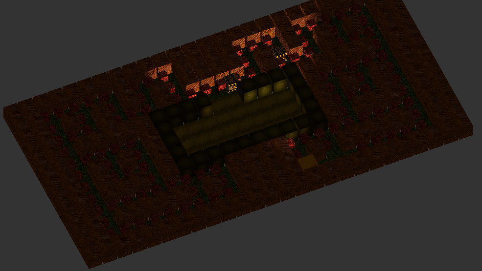

# 103085 - Computer Graphics and Multimedia

## Summary
1. [Introduction](#introduction)
2. [Learning objectives](#learning-objectives)
3. [Work package 1](#work-package-1)
4. [Work package 2](#work-package-2)
5. [Work package 3](#work-package-3)
6. [Work package 4](#work-package-4)
7. [How to play (UNIX)](#how-to-play-unix)

## Introduction
Graphical and multimedia elements can be found in most current computer applications such as web navigation, scientific data visualization, videogames and virtual reality, among many others. This project is devoted to the practical development of graphical applications in two and three dimensions using OpenGL.
Practical activities in the subject will be developed in C++, so that students should be proficient in using this programming language.

This year we will develop a project devoted to the creation of a "Pacman"-type videogame. The project is composed of four work packages. 

## Learning objectives
* Apply knowledge on mathematics to the development of graphical applications.
* Schedule activities and projects so as to hand them in time.
* Carry out the tasks detailed in a work plan in an autonomous way making use of Internet to complement the information provided.
* Implement graphical applications in two and three dimensions in C++ using the functionalities provided by OpenGL.
* Know the procedures used for the development of two and three dimension graphical applications.
* Know how to develop virtual surroundings in three dimensions.

## Work package 1
### Task 1: Random generation of a Pacman map
The generated map has to fulfill the following requirements: 
* The algorithm considers a world consisting of a two-dimensional array of squares. The number of rows and the number of columns are received as an input parameter. 
* There are two types of squares: “wall” and “corridor”. Your algorithm has to assign one of these types to each square. Employ a depth-first search procedure implemented using backtracking. 
* There is a room at the center of the map. In forthcoming work packages, this room will be the starting point for the enemies. 
* The map is vertically symmetrical. 
* The map is connected. There exists a path between each pair of corridor-type squares. 
### Task 2: Draw the Pacman map on a graphical window
* Implement a C++ program that draws a previously generated map on a graphical windows using OpenGL.
### The result of work package 1 is:

<br>

## Work package 2
### Task 1: Inclusion of food elements to the map 
* At the beginning of the game, each corridor-type square contains a food element.
* The room at the center of the map (the starting point for enemies) does not contain food.
* When the main character moves to a square containing food, it eats the food element so that the food element disappears from the square.
* A food element can be represented as a little square located at the center of the square.
### Task 2: Inclusion and animation of the main character 
Some details are given next: 
* The main character can simply be represented as a square or a circle.
* Its objective is to eat all the food elements in the map.
* The main character moves from the center of a square to the center of a contiguous one. Movements are indicated through the keyboard.
* Its movement must be smooth and implemented using variable frame rate.
* You can decide which its starting point in the map is.
### Task 3: Inclusion and animation of enemy characters 
* An enemy character can simply be represented as a square or a circle.
* Its objective is to collide against the main character.
* Its movement must be smooth and implemented using variable frame rate.
* An enemy character moves from the center of a square to the center of a contiguous one. Its movements are decided autonomously. Implement it as an agent that takes its own decisions.
* The number of enemies on the map can vary. Implement them so that your application can accommodate the dynamic addition and dynamic deletion of enemies.
* The starting point of enemies is the room located at the center of the map.
### The result of work package 2 is:

<br>

## Work package 3
### Task 1: Inclusion of 3D graphics to the game 
* It has to be possible to interactively modify the observer position employing the keyboard. The user has to be able to position the viewer at any point around the scene (even below it).
* Set polygon drawing mode so that it only fills the polygons that are facing towards the observer. This will help you to identify polygons that are not properly orientated. This can be done through the following procedure calls: glPolygonMode(GL_FRONT,GL_FILL); glPolygonMode(GL_BACK,GL_LINE);
* You can represent the game characters as a sphere. The procedure gluSphere can be useful to you.
### Task 2. Inclusion of texture mapping
* Polygons are required to be textured.
### The result of work package 3 is:

<br>

## Work package 4
### Task 1: Inclusion of lighting effects  
* Requirement. Include a light source providing ambient light. The intensity of this light source has to be low. This light source is required to avoid polygons not lighted by some other light source from appearing completely black.
* Requirement. Include a directional light source in front of the main character. In this way we will simulate it carries a flashlight.
* Optional: add a (small) flashlight to each of the enemy characters.
### Task 2: Implement the logic for the end of a game 
* Add the required code so that the game ends properly. For instance, if the main character succeeds in eating all the food elements, you can display a “You win message”, otherwise a “You lose” text can be printed.
### The result of work package 4 is:


## How to play (UNIX)
In order to compile and play the video game the next steps has to follow:
1. Install make with this comamnd:
```
sudo apt install make
```
2. Install g++ with this comamnd:
```
sudo apt install g++
```
3. Install GLUT library with this comamnd:
```
sudo apt-get install freeglut3-dev
```
4. Install LIBJPEG with this comamnd:
```
sudo apt-get install -y libjpeg-dev
```
5. Compile the code of one of the four work package with the following code:
```
make all pacman
```
**NOTE**: some libraries will be required to install in order to run this command.

6. Commands of the keyboard to move character:
```
Move UP: ↑ (up arrow)
Move DOWN: ↓ (down arrow)
Move RIGHT: → (right arrow)
Move LEFT: ← (left arrow)
```
7. Commands of the keyboard to move the camera:
```
+ Zoom == "Q"
- Zoom = "E"
Rotate UP = "W"
Rotate DOWN = "S"
Rotate RIGHT = "A"
Rotate LEFT = "D"
```
8. Auxiliar commands:
```
Close WINDOW/GAME = "ESC"
```
